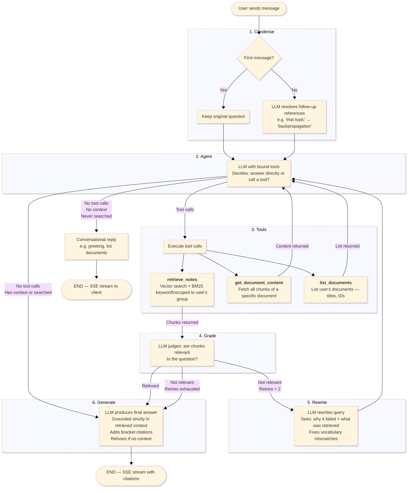

# Backend

Async Python API powering the Notes RAG application. Handles auth, document ingestion, vector search, and agentic RAG chat.

## Stack

- **FastAPI** — async web framework
- **SQLAlchemy** (async) + **asyncpg** — ORM and Postgres driver
- **Alembic** — database migrations
- **Postgres + pgvector** — relational storage and vector similarity search (ParadeDB image bundles both)
- **LangGraph** — agentic RAG pipeline with retrieval grading and corrective query rewriting
- **procrastinate** — async job queue for background document ingestion
- **OpenAI** / **Google Gemini** / **Anthropic** — pluggable LLM and embedding providers
- **Tesseract + Poppler** — OCR for scanned PDFs and images
- **Pydantic** — request/response schemas and settings
- **uv** — dependency management

## Local Setup

```bash
# 1. Start Postgres (from repo root)
make db

# 2. Copy env and fill in API keys
cp .env.example .env

# 3. Install dependencies
uv sync

# 4. Run migrations
uv run alembic upgrade head

# 5. Start the server (with live reload on Linux/macOS)
uv run python run_dev.py
```

The API is available at http://localhost:8000/docs.

The Docker Compose dev setup (`docker-compose.yml` + `docker-compose.override.yml`) also starts a worker process for background ingestion.

## Configuration

All config is loaded from environment variables via `pydantic-settings` (`app/core/config.py`). Key settings:

| Variable | Description | Default |
|----------|-------------|---------|
| `DATABASE_URL` | Postgres connection string (asyncpg) | required |
| `JWT_SECRET` | Secret for signing JWT tokens | required |
| `LLM_PROVIDER` | `openai`, `google`, `anthropic`, or `openai_compatible` | `google` (production uses `openai`) |
| `LLM_MODEL` | Model name | `gemini-2.5-flash` (production uses `gpt-4o-mini`) |
| `EMBEDDING_PROVIDER` | `openai` or `google` | `openai` |
| `OPENAI_API_KEY` | OpenAI API key | `""` |
| `GOOGLE_API_KEY` | Google API key | `""` |
| `ENVIRONMENT` | `development` or `production` | `development` |
| `COOKIE_SECURE` | Set `true` in production (HTTPS) | `false` |

See `.env.example` for the full list.

## API Routes

| Prefix | Description |
|--------|-------------|
| `POST /auth/register` | Create account |
| `POST /auth/login` | Login, returns JWT + sets refresh cookie |
| `POST /auth/refresh` | Refresh access token |
| `POST /auth/logout` | Clear refresh cookie |
| `GET /auth/me` | Current user |
| `POST /documents` | Upload a document (multipart) |
| `GET /documents` | List user's documents (optional group filter) |
| `GET /documents/{id}/download` | Download original file |
| `PATCH /documents/{id}` | Update metadata (title, group) |
| `POST /documents/{id}/replace` | Replace file content |
| `DELETE /documents/{id}` | Delete document and its chunks |
| `POST /chat` | Send a message (SSE streaming response) |
| `GET /conversations` | List conversations |
| `GET /conversations/{id}` | Conversation detail with messages |
| `PATCH /conversations/{id}` | Update conversation (title, group) |
| `DELETE /conversations/{id}` | Delete conversation |
| `POST /groups` | Create group |
| `GET /groups` | List groups |
| `PATCH /groups/{id}` | Rename group |
| `DELETE /groups/{id}` | Delete group |
| `POST /search` | Direct vector search (outside chat) |
| `GET /health` | Health check |

## Architecture

```
app/
  api/          Handlers — parse requests, call services, format responses
  services/     Business logic and orchestration
  db/
    models/     SQLAlchemy ORM models
    repositories/  CRUD operations (no business logic)
    migrations/ Alembic migration scripts
  rag/
    graph/      LangGraph agent: nodes, edges, tools, prompts, state
    parsing/    Document parsers (PDF, DOCX, PPTX, images, OCR)
    embeddings.py
    storage.py  File storage backend
  core/         Config, security, logging
  schemas/      Pydantic request/response models
  jobs/         procrastinate task definitions (ingestion worker)
```

### RAG Pipeline (LangGraph)



The agent can also answer directly (greetings, listing documents) without retrieving. Checkpoints are stored in Postgres so conversations resume across sessions.

## Testing

285 tests covering API endpoints, services, repositories, RAG graph nodes, parsing, and embeddings.

```bash
# Run all
uv run pytest

# With make (from repo root)
make test       # tests
make lint       # ruff
make typecheck  # mypy
make check      # all three
```
